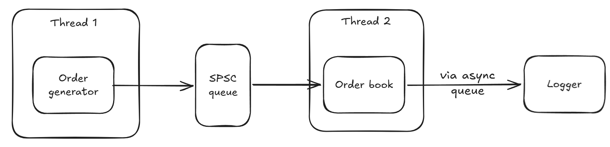

# Modules

Modules that the program consists of.

## 1. Order book

**Responsibility**: stores bids (buy orders) and asks (sell orders), matches incoming orders with the ones already in the book, and executes them if the match is satisfied.

**Inputs**: orders that contain user id (who made an order), price, amount (number of stocks to buy/sell), type of order (buy or sell).

**Outputs**: only when an order is executed, it outputs information about the executed order - ids of users whose orders were executed (if one buys/sells, then another sells/buys), price, and amount. 

**Does not do**: printing out executed orders.

## 2. Order generator

**Responsibility**: generates real-like orders with user id, price, amount, and order type, and simulates real-like behavior of the stock market (who and at which price places an order). 

**Inputs**: empty.

**Outputs**: user id, price, amount, and order type.

**Does not do**: generating orders with evenly distributed prices - it'd be better to generate orders with normally distributed (Gaussian distribution) prices. 

## 3. Logger

**Responsibility**: records the information of executed order and time of its execution. 

**Inputs**: two user ids (who buys/sells from another who sells/buys), price, and amount of executed order.

**Outputs**: empty.

**Does not do**: processing/modifications of order(-s) in any way. 

# Interfaces

